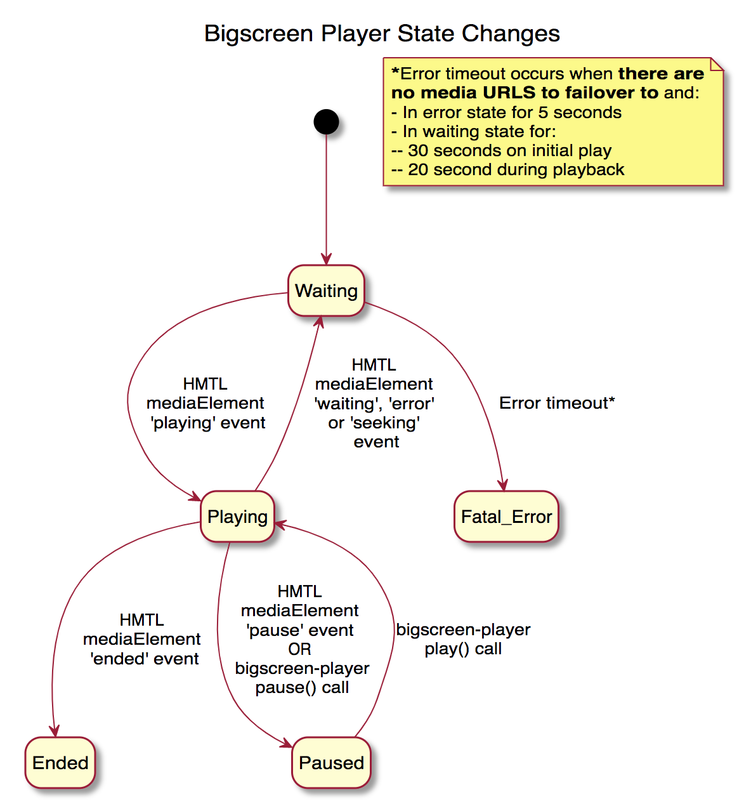

During playback, `bigscreen-player` may change state (e.g enter buffering, pause, end). Whenever the state changes, this is emitted as an event. A client can register to listen to these events with a call to `registerForStateChanges(callback)`.

The following diagram describes the flow of these events.

