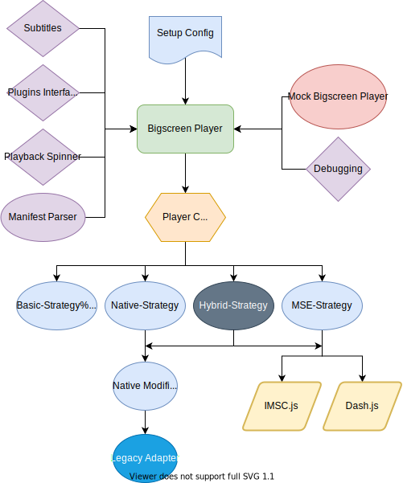

This document covers the basics of the `bigscreen-player` high level architecture. It describes an overview of the internal workings that is useful to understand in order to carry out development and possibly contribute to the code base.

Further setup code and specific examples can be found in the repo itself. A good place to start is the [README](https://github.com/bbc/bigscreen-player/blob/master/README.md).

## Dependencies
As it stands, the player relies on two dependencies:

#### [Dash.js](https://github.com/bbc/dash.js)
Our custom fork of the reference implementation of the ***dynamic adaptive streaming over http*** protocol. Used for MSE (Media Source Extension) capable devices. This is required in specifically by `bigscreen-player`, when the mse-strategy is used.

#### [imscJS](https://github.com/bbc/imscJS)
Our custom fork for rendering subtitles.

## Architecture

### Player Component
This stage provides a wrapper for the interaction with all of the individual strategies and is what `bigscreen-player` uses to interact with the video element, at its core.

## Playback Spinner
Although the player itself doesn't handle UI interaction, the playback spinner element to be shown (when buffering) is generated within `bigscreen-player`. This creates a container, and then places an element of the specified CSS class within the container. This element can then be surfaced upwards to be placed on the UI by an application's UI handler.